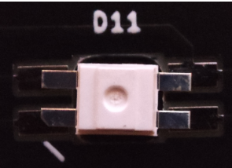

# Corne EC ビルドガイド

- [部品リスト](#部品リスト)
  - [キットに同梱されている部品](#キットに同梱されている部品)
  - [キット以外に必要な部品](#キット以外に必要な部品)
- [組み立て手順](#組み立て手順)
  - [(オプション)LEDを付ける](#オプションledを付ける)
  - [XIAOを取り付ける](#xiaoを取り付ける)
  - [表面のリード部品を取り付ける](#表面のリード部品を取り付ける)
  - [トッププレートにスペーサー、スイッチを取り付ける](#トッププレートにスペーサースイッチを取り付ける)
  - [メイン基板とミドルプレートを挟んでボトムプレートをネジ止めする](#メイン基板とミドルプレートを挟んでボトムプレートをネジ止めする)
- [ファームウェア](#ファームウェア)
  - [ファームウェアを書き込む](#ファームウェアを書き込む)
  - [キーマップを設定する](#キーマップを設定する)
  - [Handednessを設定する](#handednessを設定する)
  - [キーの動作点を調整する](#キーの動作点を調整する)
    - [AD変換値を確認する](#ad変換値を確認する)
    - [しきい値を設定する](#しきい値を設定する)
  - [ファームウェアを改造する場合](#ファームウェアを改造する場合)

## 部品リスト

### キットに同梱されている部品

|部品|数|
|-|-|
|メイン基板|2|
|トッププレート|2|
|ミドルプレート|2|
|ボトムプレート|2|
|カバープレート|2|
|TRRSジャック|2|
|静電容量スキャンモジュール|2|
|ピンヘッダ|2|
|M2ネジ|28|
|M2x8スペーサー|14|
|ゴム足|8|
|**バネ同梱版の場合**||
|円錐バネ|42個くらい|

**円錐バネは試作品です**
DES-DOMESのように上面に穴が空いているラバードームと組み合わせたときに、スイッチの最初の1.5mmくらいのトラベルが不感帯になってしまうという問題があります。そのため動作点を浅くしたい場合はNizのラバードームなどとの組み合わせをお勧めします。


### キット以外に必要な部品

|部品|数|入手先|
|-|-|-|
|Seed XIAO RP2040|2|https://akizukidenshi.com/catalog/g/gM-17044/, https://www.seeedstudio.com/XIAO-RP2040-v1-0-p-5026.html|
|NIZ EC Switch|42|https://www.nizkeyboard.com/collections/ornaments/products/2019-new-niz-ec-switch|
|ラバードーム|必要分|https://www.nizkeyboard.com/collections/ornaments/products/ec-silicone-domes-35g-45g-55g, https://btoshop.jp/2020/09/25/adelcpru/|
|TRRSケーブル|1|
|USBケーブル|1|
||||
|**バネ同梱版ではない場合**|||
|円錐バネ|42|https://btoshop.jp/2020/09/25/adelcps/|
||||
|**LEDを付ける場合**|||
|SK6812MINI-E|42|https://shop.yushakobo.jp/collections/all-products/products/sk6812mini-e-10|

## 組み立て手順

### (オプション)LEDを付ける

- 基板にマークがついているところと、LEDのピンの切り欠きの向きを合わせてください
- 列によって向きが異なります。注意してください

|||
|-|-|
|ピンの切り欠きと基板のマークを合わせる|列によってマークの向きが異なります|

### XIAOを取り付ける

- 基板に直接はんだ付け、またはピンヘッダを取り付けてからはんだ付けします
  - LEDを取り付けている場合、ミドルプレートの上に乗せておくと安定します
  - 基板に直接はんだ付けする場合、はんだ付けする側面と逆側の穴に固定用のピンヘッダを差し込んでおくとずれにくいです

|||
|-|-|
|XIAOの側面と基板を直接はんだ付けしてください|**反対側の**穴にピンヘッダを差し込むと位置合わせしやすくなります|

### 表面のリード部品を取り付ける

- TRRSジャックとスキャンモジュールをはんだ付けします


### トッププレートにスペーサー、スイッチを取り付ける

- ハウジング、ステム、ラバードーム、コニックリングの順に取り付けます


### メイン基板とミドルプレートを挟んでボトムプレートをネジ止めする

- トッププレート -> スイッチ -> メイン基板　-> ミドルプレート -> ボトムプレート の順になるように重ねてはんだ付けしてください


## ファームウェア

### ファームウェアを書き込む

- 左右それぞれのXIAO RP2040のブートローダを起動し、UF2ファイルを書き込みます。
- 初回書き込み時にはEEHANDSの初期化のため左右それぞれ別のファームウェアを書き込んでください。EEHANDS設定以降はどちらでも問題ありません。
  - [左手用](firmware/sekigon_crkbd_ec_default_left.uf2)
  - [右手用](firmware/sekigon_crkbd_ec_default_right.uf2)

### キーマップを設定する

- [REMAP](https://remap-keys.app/)からキーマップを書き換えられます
  - VIAで使用する場合は[json](firmware/crkbd_ec.json)を読み込ませてください

### Handednessを設定する

- キーボードの左右がおかしい場合はキーマップに`EH LEFT(MAGIC_EE_HANDS_LEFT)`または`EH_RGHT(MAGIC_EE_HANDS_RIGHT)`を設定して切り替えてください

### キーの動作点を調整する
#### AD変換値を確認する

- [Web Serial Plotter](https://sekigon-gonnoc.github.io/web-serial-plotter/)をChromeで開いてください
- `OPEN`ボタンをクリックします
- Corne ECを選択して接続ボタンを押します
- `Output Text`に`e`と入力して`SEND`ボタンをクリックするとキーボードからスイッチの読み取り値が送信されます
- 列ごとにスイッチのAD変換値がプロットされるので、スイッチを押して値の変化を確認してください
  - 他のキーと明らかに傾向が違うスイッチは円錐バネの位置がずれている可能性があります
- 結果をもとにスイッチの動作しきい値を決めます
  - HIGH_THRESHOLD: この値を超えたらキーを押したと判定する
  - LOW_THRESHOLD: この値を下回ったらキーを離したと判定する
  - `LOW_THRESHOLD < HIGH_THRESHOLD` の大小関係を守ってください

#### しきい値を設定する
  - Web Serial Plotterを閉じて[ECSKB Configurator](https://sekigon-gonnoc.github.io/ecskb-configurator/)を開いてください
  - `read` ボタンを押すと現在の設定値を読み取れます
  - 先程決めたしきい値を入力して`write`ボタンを押します
  - Corne ECを選択して接続ボタンをクリックすると設定が反映されます
  - 反対側のキーボードも同様に設定してください


### ファームウェアを改造する場合

- https://github.com/sekigon-gonnoc/qmk_firmware/tree/rp2040 をチェックアウトする

```bash
make sekigon/crkbd_ec:default:uf2
```