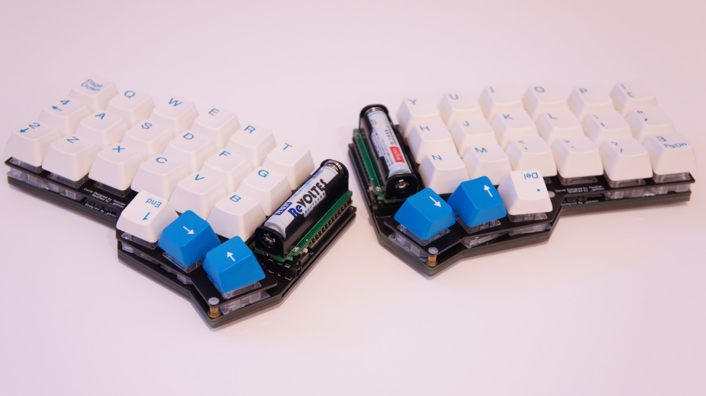
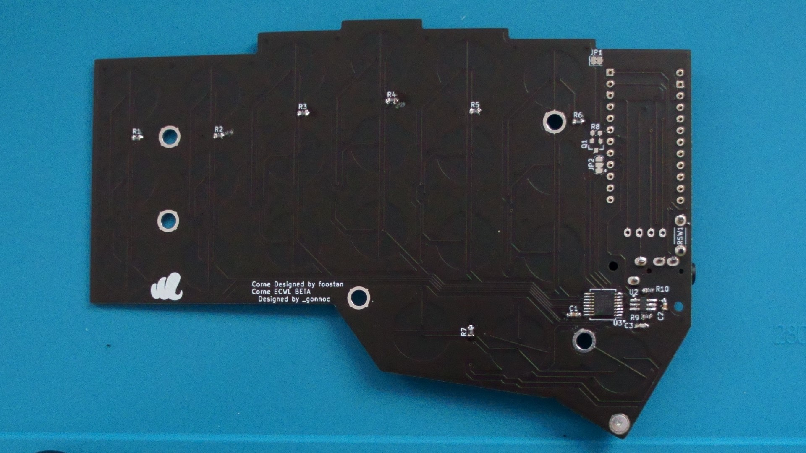
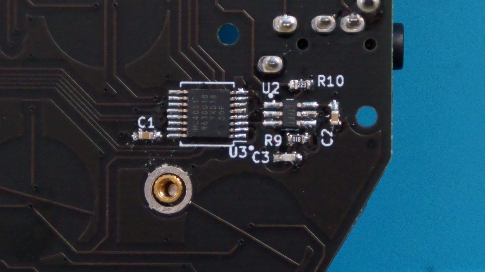
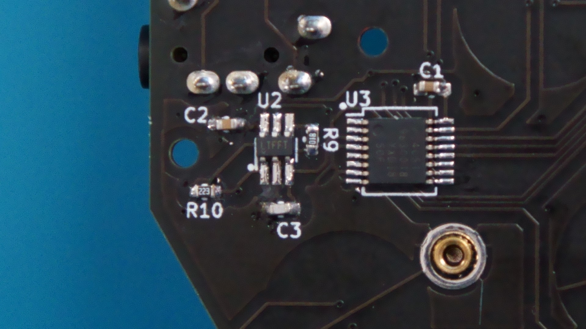
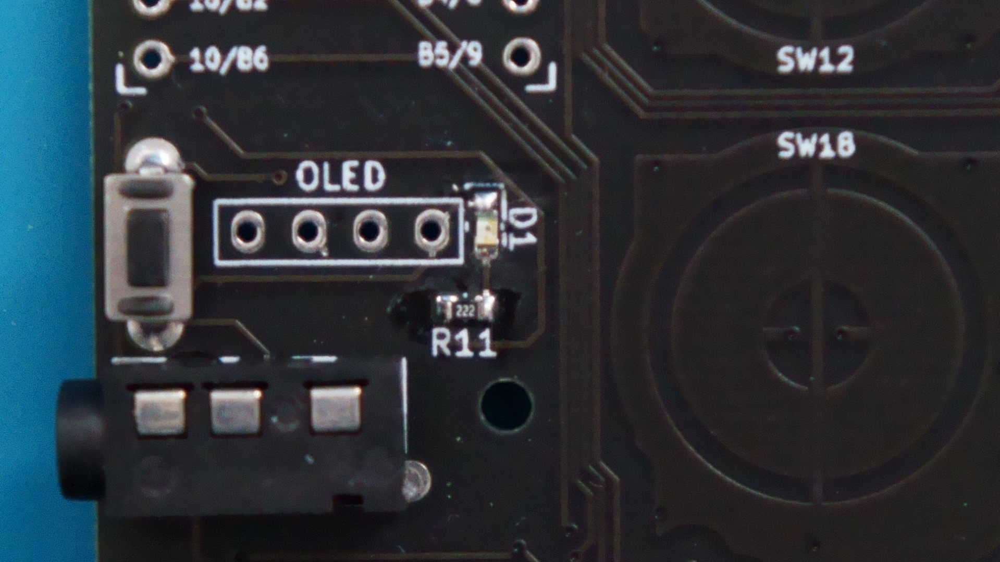
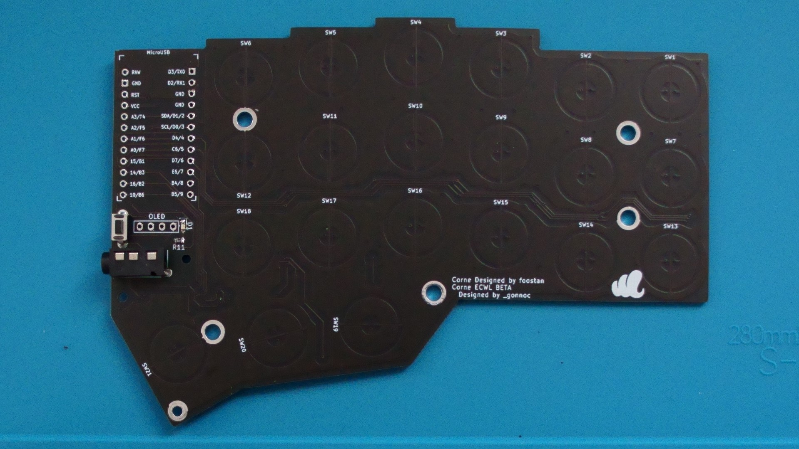
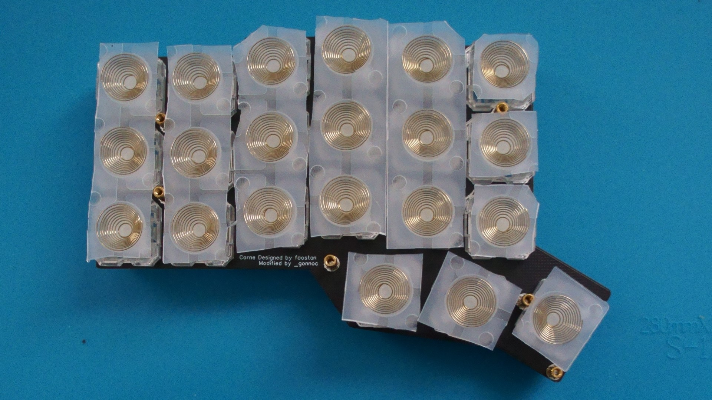
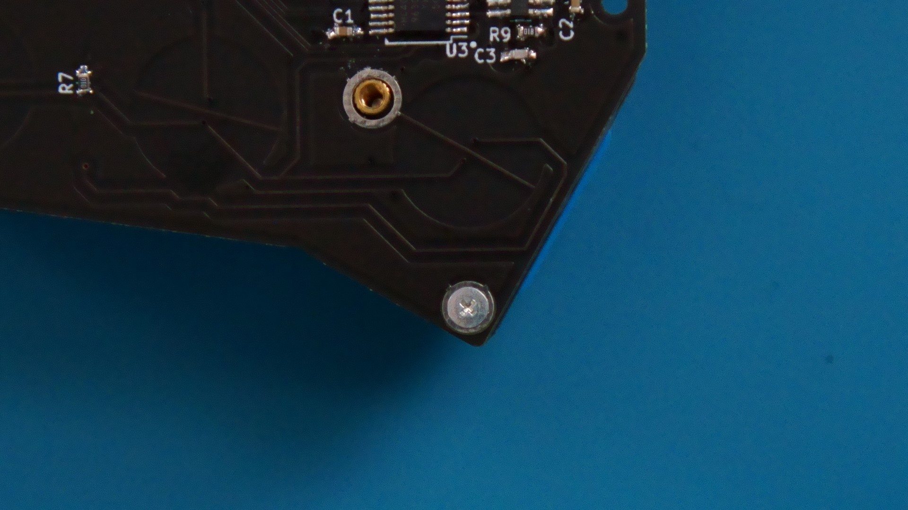
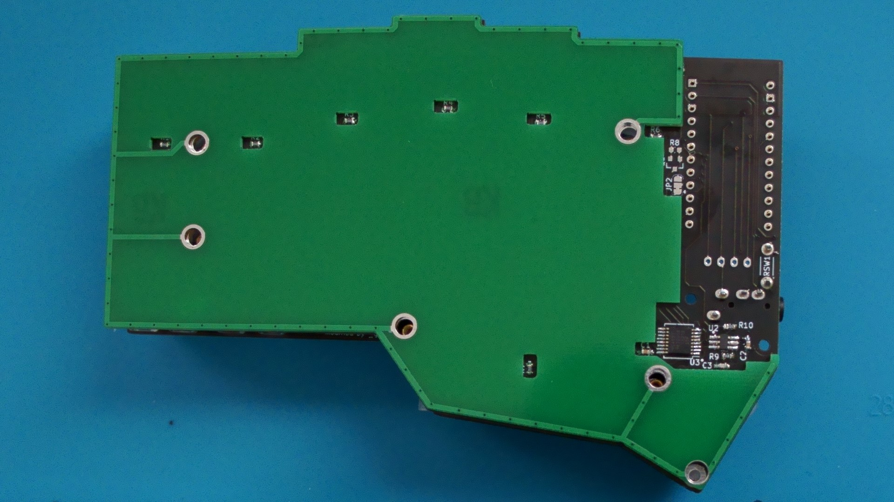
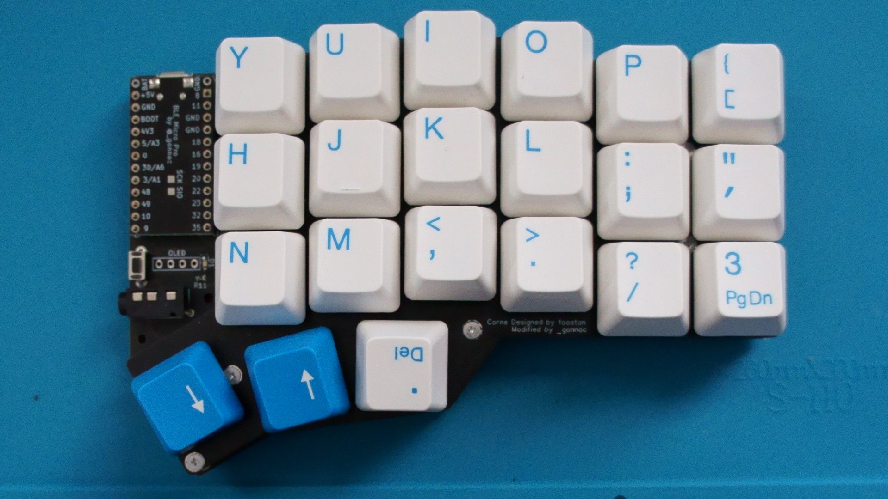

# CorneECWL


- [部品リスト](#部品リスト)
  - [キットに同梱されている部品](#キットに同梱されている部品)
  - [キット以外に必要な部品](#キット以外に必要な部品)
- [組み立て手順](#組み立て手順)
  - [裏面の表面実装部品を取り付ける](#裏面の表面実装部品を取り付ける)
  - [(BLE Micro Proのインジケータ機能を使う場合)表面の表面実装部品を取り付ける](#ble-micro-proのインジケータ機能を使う場合表面の表面実装部品を取り付ける)
  - [表面のリード部品を取り付ける](#表面のリード部品を取り付ける)
  - [トッププレートにスペーサーを取り付ける](#トッププレートにスペーサーを取り付ける)
  - [トッププレートにスイッチを取り付ける](#トッププレートにスイッチを取り付ける)
  - [メイン基板をトッププレートにネジ止めする](#メイン基板をトッププレートにネジ止めする)
  - [ミドルプレートを挟んでボトム基板をネジ止めする](#ミドルプレートを挟んでボトム基板をネジ止めする)
  - [Pro MicroまたはBLE Micro Proを取り付ける](#pro-microまたはble-micro-proを取り付ける)
- [ファームウェア](#ファームウェア)
  - [Pro Microの場合](#pro-microの場合)
  - [BLE Micro Proの場合](#ble-micro-proの場合)

## 部品リスト
### キットに同梱されている部品
オペアンプはSOT23-6, マルチプレクサはTSSOP, それ以外のチップ部品は0603(1608)サイズです

|部品|数|
|-|-|
|メイン基板|2|
|トッププレート|2|
|ミドルプレート|2|
|ボトムプレート|2|
|TRRSジャック|2|
|タクトスイッチ|2|
|マルチプレクサIC|2|
|オペアンプIC|2|
|100kΩ|14|
|22kΩ|2|
|2.2kΩ|2|
|1kΩ|2|
|0.1uF|4|
|220pF|2|
|赤色LED|2|
|M2ネジ|24|
|M2x8スペーサー|10|
|M2x5スペーサー|2|
|ゴム足|8|


### キット以外に必要な部品

|部品|数|入手先|
|-|-|-|
|Pro MicroまたはBLE Micro Pro|2|https://booth.pm/ja/items/1177319, https://yushakobo.jp/shop/ble-micro-pro/|
|12ピンコンスルーまたはピンヘッダ|4|https://yushakobo.jp/shop/a01mc-00/, https://talpkeyboard.stores.jp/items/5e056626d790db16e2889233|
|NIZ EC Switch|42|https://www.nizkeyboard.com/collections/ornaments/products/2019-new-niz-ec-switch|
|ラバードーム|必要分|https://www.nizkeyboard.com/collections/ornaments/products/ec-silicone-domes-35g-45g-55g, https://btoshop.jp/2020/09/25/adelcpru/|
|コニックリング|42|https://btoshop.jp/2020/09/25/adelcps/|
||||
|**Pro Microを使う場合**|||
|TRRSケーブル|1|
|USBケーブル|1|
||||
|**BLE Micro Proを使う場合(消費電力高めです)**|||
|電池基板|2|https://nogikes.booth.pm/items/1655285, https://yushakobo.jp/shop/ble-micro-pro-battery-board/|

## 組み立て手順
### 裏面の表面実装部品を取り付ける

- 部品表
    |番号|値|
    |-|-|
    |R1-R7|100kΩ|
    |R9|1kΩ|
    |R10|22kΩ|
    |C1, C2|0.1uF|
    |C3|220pF|

- ICの向きに注意
  - マルチプレクサは1ピン側にくぼみが、オペアンプは1ピン側に矢印がついている





### (BLE Micro Proのインジケータ機能を使う場合)表面の表面実装部品を取り付ける

- 部品表
    |番号|値|
    |-|-|
    |R11|2.2kΩ|
    |D1|LED(OSHR1608)|

- LEDの向きに注意
  - ロットによってLED裏側の極性表示が異なるので注意
  - 発光点がカソードに偏っているので表側からでも判別できる
  - 基板側はシルクで囲われている側がカソード


### 表面のリード部品を取り付ける
- TRRSジャックとリセットスイッチを付ける
  - リセットスイッチの足はそのままだとボトムプレート若干接触してしまうのでニッパーで切る


### トッププレートにスペーサーを取り付ける
- 親指側の基板端のみ5mmのスペーサー、残りは8mmのスペーサー

### トッププレートにスイッチを取り付ける
- ハウジング、ステム、ラバードーム、コニックリングの順に設置する


### メイン基板をトッププレートにネジ止めする
- 5mmスペーサーでトッププレートとメイン基板をとめる


### ミドルプレートを挟んでボトム基板をネジ止めする
- 8mmスペーサーのほうがトッププレートとボトムプレートの距離より若干短いため、ネジを締めすぎないようにする


### Pro MicroまたはBLE Micro Proを取り付ける
- 裏向きに付ける


## ファームウェア
### Pro Microの場合
- リポジトリを取得
  - https://github.com/sekigon-gonnoc/qmk_firmware/tree/dev/crkbd_ecwl  
  - 静電容量スイッチが読み取れるかは空のキーマップで確認します  
  - キーボードの左右の識別にはEE_HANDSを使用しているので、最初の書き込みには`-split-left`または`-split-right`をつけてください  

- 左手に書き込む
  ```
  make crkbd_ecwl:blank:avrdude-split-left
  ```

- 右手に書き込む
  ```
  make crkbd_ecwl:blank:avrdude-split-right
  ```

- キースキャン結果を確認する
  - qmk_toolboxまたはhid_listenでキーボードに接続するとUSB接続したほうの手のスキャン結果AD変換値が表示されます  
  - デフォルトの閾値はH:300, L:200です。閾値を変更する場合はmatrix.cを編集してください
  - キースキャンの結果に問題がなければ、有効なキーマップを書き込んでください

- キーマップを書き込む
  ```
  make crkbd_ecwl:default:flash
  ```

### BLE Micro Proの場合

- BLE Micro Pro Web Configuratorを使ってCorne ECWL用のファームを書き込む
- BLE Micro Pro用QMK Configuratorを使ってキーマップを書き込む
- それぞれのツールの詳しい使い方についてはBLE Micro Proのドキュメントを参照してください
- 消費電力が高いので時間経過によるオートスリープを有効にすることをおすすめします。
  - スリープモードから復帰するにはそれぞれのキーボードの適当なキーを、インジケータLEDが点滅するまで押してください